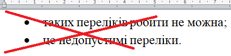

<!-- Google tag (gtag.js) -->
<script async src="https://www.googletagmanager.com/gtag/js?id=G-74DZG0CQKR"></script>
<script>
  window.dataLayer = window.dataLayer || [];
  function gtag(){dataLayer.push(arguments);}
  gtag('js', new Date());

  gtag('config', 'G-74DZG0CQKR');
</script>

# Перевірка бакалаврських робіт на відповідність дсту

Поточним актуальним стандартом оформлення робіт є [ДСТУ 3008:2015](https://github.com/GeorgKantsedal/HeorhiiKantsedal.github.io/blob/bc2947c6e80a6291f4e1256120b3516717d4da1f/dstu/dstu-3008-2015.pdf), видання 2015 року

## Основні вимоги та помилки
1. Нумерація сторінок зверху по правому краю наскрізна, першу (титульну) сторінку не нумеруємо.

2. Шрифт Times New Roman 14 пт; абзац 1,5, перед абзацем відступ 0пт, після абзацу відступ 0пт. Основний текст має вирівнювання по ширині.

3. Поля: ліве 3 см, верхне 2 см, нижне 2 см, праве 1,5 см.

4. Якщо в роботі розроблено програмний продукт, то в РЕФЕРАТі та в ABSTRACT’і вказуємо, що розроблено програмний продукт на мові програмування (вказуємо). 1 додаток – 1 appendix (однина), 2 додатки або більше – це вже appendices (множина).

5. Заголовки РЕФЕРАТ, ABSTRACT, ЗМІСТ, ВСТУП, 1 НАЗВА ПЕРШОГО РОЗДІЛУ, 2 НАЗВА ДРУГОГО РОЗДІЛУ, ..., ВИСНОВКИ, ПЕРЕЛІК ДЖЕРЕЛ ПОСИЛАННЯ, ДОДАТОК А, ДОДАТОК Б друкуємо великими літерами.
Зверніть увагу на назву ПЕРЕЛІК ДЖЕРЕЛ ПОСИЛАННЯ (тобто не список літератури і не перелік використаних джерел).
Слово «РОЗДІЛ» в заголовках можна або писати, або можна не писати. Тобто варіанти оформлення 3 ПРОГРАМНА РЕАЛІЗАЦІЯ та РОЗДІЛ 3 ПРОГРАМНА РЕАЛІЗАЦІЯ без крапки в кінці є допустимими варіантами оформлення (виберіть для себе один з двох варіантів оформлення і притримуйтесь його по всій роботі).

6. Відстань над заголовком і під заголовком до основного текста має бути два порожні рядки (2 Enter’а). Між заголовком верхнього рівня та заголовком нижнього рівня можна ставити менше ніж два рядки. Під заголовком на сторінці має бути не менше двох рядків основного тексту («висячі» заголовки заборонені).

7. Формули нумеруємо подвійною нумерацією, тобто номер формули складається з номера розділу та порядкового номера формули в цьому розділі. Нумеруємо лише ті формули, на які є посилання.

8. Рисунки нумеруємо подвійною нумерацією, тобто номер рисунка складається з номера розділу та порядкового номера рисунка в цьому розділі і розташований під рисунком. На кожен рисунок має бути посилання в тексті, причому має бути спочатку посилання на рисунок, а потім - сам рисунок. 

9. Таблиці нумеруємо подвійною нумерацією, тобто номер таблиці складається з номера розділу та порядкового номера таблиці в цьому розділі і розташований над таблицею. На кожну таблицю має бути посилання в тексті, причому має бути спочатку посилання на таблицю, а потім - сама таблиця. Якщо таблиця велика і розбивається на декілька сторінок, то над першою частиною таблиці пишемо «Таблиця ». Над іншими частинами таблиці пишемо «Продовження таблиці » або «Кінець таблиці __» без повторення назви таблиці.

10. Вмикаємо правопис – це дозволяє швидко уникнути багатьох помилок.

11. В ПЕРЕЛІКУ ДЖЕРЕЛ ПОСИЛАННЯ згідно з правилами від 2015 року дуже мало тире «–», дуже мало дефісів «-» і дуже мало «/». Тобто, якщо маєте багато «–», «-» або «/», то подивіться надісланий файл perelik-DSTU.pdf. Якщо рік розташований після авторів у круглих дужках, то переносимо рік після видавництва, якщо це книжка, або після назви журналу, якщо це журнал. Дужки навколо року зайві.

12. Якщо в ДОДАТКУ А маєте код програми, то краще вибрати моноширинний шрифт (наприклад, Courier New, Consolas або інший), а також краще вибрати менший шрифт.

13. Під календарним планом, де розташовані підписи, вказуємо Ім’я ПРІЗВИЩЕ

## Оформлення переліків

Окремо варто розглянути оформлення переліків у дипломній роботі. В ДСТУ рекомендовано малі літери української абетки, арабські цифри, знаки «тире».
 
Рекомендуємо оформлювати переліки за наступною логікою. 
```
Логіка переліку з крапкою.
1. Припустимо, що кожен елемент переліку довгий. Дуже довгий.
2. Припустимо, що деякі елементи переліку складаються із декількох речень. Причому кожне речення завершується крапкою в кінці. Наприклад, цей елемент переліку складається з трьох речень, кожне з яких завершується крапкою.
3. Тоді бажано, щоб слово перед переліком завершувалось крапкою. В даному прикладі я поставив крапку після слова «крапкою».
5. Кожен елемент такого переліку повинен починатись з великої літери.
6. Кожен елемент переліку завершується крапкою.
```

Інший варіант короткого переліку:
```
Перелік з малої літери:
1) кожен елемент цього переліку невеликий;
2) цей елемент містить всього шість слів;
3) так оформляти також можна;
4) кожен елемент такого переліку повинен починатись з маленької літери;
5) після слова "літери" має бути двокрапка, за потреби можна переформульовувати речення перед переліком;
6) кожен елемент переліку, окрім останнього, завершується крапкою з комою.
```

Наостанок приклад короткого переліку через тире, однак для уніфікації рекомендую по можливості обмежитись попередніми двома
(адже довжина тире може бути проставлена різна в ворді і відповідно використання двох різних довжин тире можна вважати помилкою оформлення):
```
- вказані вище переліки допустимі;
- пропоновані в ДСТУ типи переліків також допустимі;
- кожен елемент такого переліку має починатись з маленької літери;
- всередині переліку не може бути крапки, крапка лише в кінці.
```

*Переліків через великі крапки бажано уникати, їх немає в ДСТУ!*



## Оформлення посилань на літературу

Оформлення літератури здійснюється за наступним [прикладом](https://github.com/GeorgKantsedal/HeorhiiKantsedal.github.io/blob/bc2947c6e80a6291f4e1256120b3516717d4da1f/dstu/perelik-DSTU.pdf).

## Автоматична перед перевірка робіт

Для полегшення перевірки було розроблено автоматизовану систему перевірки бакалаврських робіт.
Система виявляє найпоширеніші помилки й покриває 90% випадків оформлення. 
У складних випадках фінальну перевірку забезпечує відповідальна особа (тобто у випадку не згоди з результатом перевірки робота надається відповідальному викладачу).
Рекомендовано перед поданням роботи на перевірку відповідальній особі обов'язково пройти і мінімізувати помилки виявленні автоматизованою системою.

Для перевірки.
1. Робота повинна бути в PDF.
2. Робота повинна містити зміст за титульні аркуші. Перевірка титульних аркушів системою не здійснюється.
3. Зміст повинен містити крапки для кожного з пунктів змісту (між назвою розділу та сторінкою).

Бажано. 
1. Бажано не використовувати зображення вставлені в роботу без обрізання та обрізані за допомогою текстового редактора (наприклад word може зберігати усю інформацію що ускладнює перевірку). 
2. При значному відхиленні роботи від стандарту (наприклад при оформленні змісту) можливе виникнення помилки сервера. 
3. Якщо ви вставляєте формули як зображення, то вони класифікуються як зображення і як неправильне оформлення. Формули повинні бути формулами, а зображення зображеннями. 
4. Малюнки з текстом можуть бути класифіковані як текст. 

У випадку проблем з системою прошу повідомити tg @welheor, @Heorhii_Kantsedal.

[Перевірка на ДСТУ](https://dstu.labx.pp.ua/)
